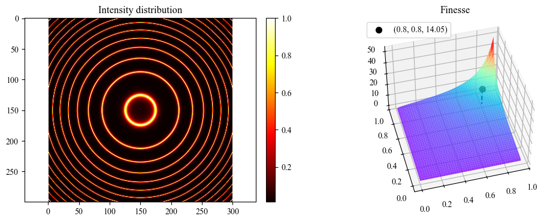

# Introduction
The simulations presented here are implemented in **Python**, using the [LightPipes](https://opticspy.github.io/lightpipes/) library for optical field simulations.  

LightPipes provides powerful tools for modeling the propagation of light, interference, diffraction, and other wave-optics phenomena, making it especially useful for experiments such as interferometry and beam shaping.  

Currently, I have completed two laser projects which are:
- Visualisation of Finesse Through Fabry Perot Interferometer
- Self Healing Propertes of Airy Beam.

# Results
It is truly rewarding to be able to apply the theories and equations learnt in lectures, and see the results firsthand.

  

Figure 1: Two dimensional finesse

  https://github.com/user-attachments/assets/c63416cf-cb95-4a47-bab9-21d15e8805c9

Figure 2: Self-Healing Properties of Airy Beam

